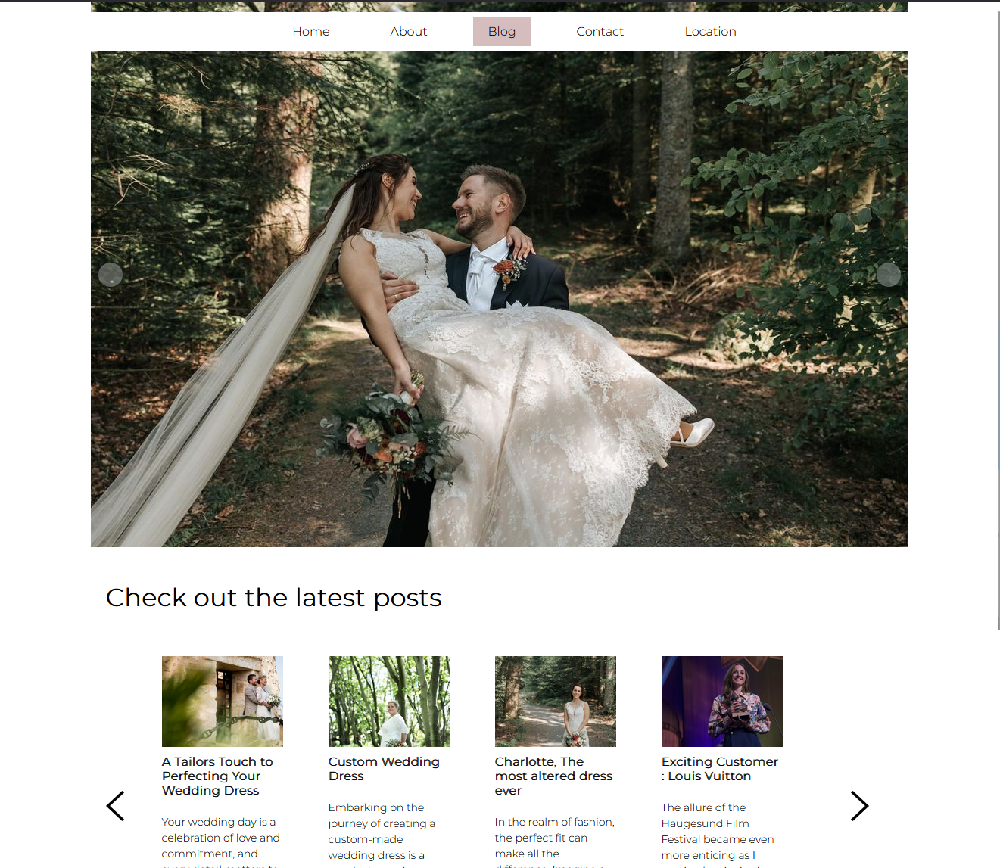

# Project Exam 1 - Lykke og Liten WordPress API Project



## Description

This project, named "Project Exam 1 - Lykke og Liten," serves as the official website for my local business. It provides customers with easy access to information about my alteration services, showcases previous work, and features blog posts. The website includes a Google Map integration for locating my business, a contact form allowing users to specify the type of alteration they need along with a brief description, and quick links to my social media profiles. Users can also contact me directly via email or phone call through the provided buttons in the footer.

## Built With

I created an API using WordPress for my Project Exam 1 to enhance the online presence of "Lykke og Liten." The website is developed using VS Code, with no additional plugins used other than Prettier and GitHub Classroom. The repository is hosted on my GitHub profile, and the live version is deployed on [Netlify](https://lykkeogliten.netlify.app).

### Tech Stack

- WordPress
- VS Code
  Plug in :
- Contact form 7

### Getting Started

#### Installing

To get started, clone the repo:

<!-- ```bash
git clone https://github.com/BergitTveit/Project-Exam-1.git -->

#### Running

?

### Contributing

If you'd like to contribute to the project, please follow these steps:

1. Fork the repository.
2. Create a new branch.
3. Make your changes.
4. Open a pull request for review.

### Connect with Me

- LinkedIn: [](https://www.linkedin.com/in/bergit-tveit-672588152)
- Instagram (Business): [Lykke & Liten](https://www.instagram.com/lykkeogliten/)
- Instagram (Personal): [Leafing in the Moment](https://www.instagram.com/leafinginthemoment/)

#### Acknowledgments

Special thanks to the two following people for helping me further my knowledge within JS:

- [Milena Mazur](https://www.linkedin.com/in/milena-mazur-b73a58299/)
- [Milosz Mazur](https://www.linkedin.com/in/mazurmilosz/)
